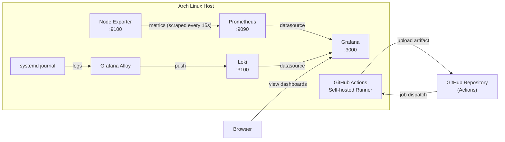

# Server Monitoring, Logging & CI Pipeline

|                      |                                          |
| -------------------- | ---------------------------------------- |
| **Student Name**     | Tamim                                    |
| **Batch**            | 14                                       |
| **Assignment Title** | Server Monitoring, Logging & CI Pipeline |

---

## Table of Contents

1. [Project Overview](#project-overview)
2. [Architecture Diagram](#architecture-diagram)
3. [Repository Structure](#repository-structure)
4. [Installation Steps](#installation-steps)
5. [Configuration Details](#configuration-details)
6. [CI Pipeline Explanation](#ci-pipeline-explanation)
7. [Screenshots](#screenshots)
8. [Result / Conclusion](#result--conclusion)

---

## Project Overview

This project sets up a complete monitoring, logging, and continuous integration stack on a single Arch Linux machine. Every component was installed **manually from its official release tarball** and configured as a **hand-written systemd service**, with no package manager installs for the monitoring tools.

| Component                             | Role                                              | Port       |
| ------------------------------------- | ------------------------------------------------- | ---------- |
| **Node Exporter**                     | Exposes host metrics (CPU, RAM, disk, network)    | 9100       |
| **Prometheus**                        | Scrapes and stores metrics                        | 9090       |
| **Grafana**                           | Dashboards and visualization for metrics and logs | 3000       |
| **Loki**                              | Log aggregation and storage                       | 3100       |
| **Grafana Alloy**                     | Ships systemd journal logs to Loki                | 12345 (UI) |
| **GitHub Actions self-hosted runner** | Runs the CI pipeline on this machine              | n/a        |
| **Express.js hello-world app**        | Dummy project used by the CI pipeline             | 3001       |

**Environment:** Arch Linux, systemd, Node.js from the Arch repositories (used only for the dummy CI app).

---

## Architecture Diagram



**Data flow**

- **Metrics:** Node Exporter exposes system metrics, Prometheus scrapes them, and Grafana queries Prometheus with PromQL.
- **Logs:** systemd-journald collects system logs, Alloy reads the journal and pushes to Loki, and Grafana queries Loki with LogQL.
- **CI:** A push to GitHub triggers the workflow. The self-hosted runner on this machine builds, tests, and packages the app, then uploads the build output as an artifact.

---

## Repository Structure

```
.
├── README.md
├── app/                         # Dummy Express.js app used by CI
│   ├── package.json
│   ├── package-lock.json
│   ├── src/
│   │   ├── app.js
│   │   └── server.js
│   └── test/
│       └── app.test.js
├── node_exporter/
│   └── node_exporter.service
├── prometheus/
│   ├── prometheus.yml
│   └── prometheus.service
├── grafana/
│   ├── grafana.service
│   └── dashboard.json
├── loki/
│   ├── loki-config.yml
│   ├── loki.service
│   ├── config.alloy
│   └── alloy.service
├── .github/
│   └── workflows/
│       └── ci.yml
└── screenshots/
```

---

## Installation Steps

Every component follows the same pattern: download the release tarball, create a dedicated system user, install the binary, write a systemd unit, then enable and start it. Replace `VER` with the current release version from each project's GitHub releases or download page.

### 1. Node Exporter

```bash
VER=1.x.x
cd /tmp
curl -LO https://github.com/prometheus/node_exporter/releases/download/v${VER}/node_exporter-${VER}.linux-amd64.tar.gz
tar xzf node_exporter-${VER}.linux-amd64.tar.gz

sudo useradd --no-create-home --shell /usr/bin/nologin node_exporter
sudo install -o node_exporter -g node_exporter \
  node_exporter-${VER}.linux-amd64/node_exporter /usr/local/bin/node_exporter

sudo cp node_exporter/node_exporter.service /etc/systemd/system/
sudo systemctl daemon-reload
sudo systemctl enable --now node_exporter
```

Verify:

```bash
systemctl status node_exporter
curl -s localhost:9100/metrics | head
```

### 2. Prometheus

```bash
VER=3.x.x
cd /tmp
curl -LO https://github.com/prometheus/prometheus/releases/download/v${VER}/prometheus-${VER}.linux-amd64.tar.gz
tar xzf prometheus-${VER}.linux-amd64.tar.gz
cd prometheus-${VER}.linux-amd64

sudo useradd --no-create-home --shell /usr/bin/nologin prometheus
sudo mkdir -p /etc/prometheus /var/lib/prometheus
sudo install -o prometheus -g prometheus prometheus promtool /usr/local/bin/

# from the root of this repository
sudo cp prometheus/prometheus.yml /etc/prometheus/prometheus.yml
sudo chown -R prometheus:prometheus /etc/prometheus /var/lib/prometheus
promtool check config /etc/prometheus/prometheus.yml

sudo cp prometheus/prometheus.service /etc/systemd/system/
sudo systemctl daemon-reload
sudo systemctl enable --now prometheus
```

Verify: open `http://localhost:9090/targets`. The `node_exporter` target must show **UP**.

### 3. Grafana

```bash
VER=12.x.x
cd /tmp
curl -LO https://dl.grafana.com/oss/release/grafana-${VER}.linux-amd64.tar.gz
tar xzf grafana-${VER}.linux-amd64.tar.gz

sudo useradd --no-create-home --shell /usr/bin/nologin grafana
sudo mv grafana-${VER} /opt/grafana
sudo mkdir -p /var/lib/grafana /var/log/grafana
sudo chown -R grafana:grafana /opt/grafana /var/lib/grafana /var/log/grafana

# from the root of this repository
sudo cp grafana/grafana.service /etc/systemd/system/
sudo systemctl daemon-reload
sudo systemctl enable --now grafana
```

Open `http://localhost:3000` (default login `admin` / `admin`, then set a new password).

**Add the Prometheus datasource:** Connections → Data sources → Add data source → Prometheus → URL `http://localhost:9090` → Save & test.

**Import the dashboard:** Dashboards → New → Import → upload `grafana/dashboard.json`.

### 4. Loki

```bash
sudo pacman -S --needed unzip
VER=3.x.x
cd /tmp
curl -LO https://github.com/grafana/loki/releases/download/v${VER}/loki-linux-amd64.zip
unzip loki-linux-amd64.zip

sudo useradd --no-create-home --shell /usr/bin/nologin loki
sudo install -o loki -g loki loki-linux-amd64 /usr/local/bin/loki
sudo mkdir -p /etc/loki /var/lib/loki
sudo chown -R loki:loki /var/lib/loki

# from the root of this repository
sudo cp loki/loki-config.yml /etc/loki/loki-config.yml
sudo cp loki/loki.service /etc/systemd/system/
sudo systemctl daemon-reload
sudo systemctl enable --now loki
curl localhost:3100/ready
```

**Add the Loki datasource:** Connections → Data sources → Add data source → Loki → URL `http://localhost:3100` → Save & test.

### 5. Grafana Alloy (log shipper)

```bash
VER=1.x.x
cd /tmp
curl -LO https://github.com/grafana/alloy/releases/download/v${VER}/alloy-linux-amd64.zip
unzip alloy-linux-amd64.zip

sudo useradd --no-create-home --shell /usr/bin/nologin alloy
sudo usermod -aG systemd-journal alloy
sudo install -o alloy -g alloy alloy-linux-amd64 /usr/local/bin/alloy
sudo mkdir -p /etc/alloy /var/lib/alloy
sudo chown -R alloy:alloy /var/lib/alloy

# from the root of this repository
sudo cp loki/config.alloy /etc/alloy/config.alloy
sudo cp loki/alloy.service /etc/systemd/system/
sudo systemctl daemon-reload
sudo systemctl enable --now alloy
```

Test that logs arrive: run `logger "hello from loki test"`, then in Grafana → Explore → Loki, run `{job="systemd-journal"} |= "hello from loki test"`.

### 6. GitHub Actions self-hosted runner

1. In the repository on GitHub: **Settings → Actions → Runners → New self-hosted runner** (Linux, x64).
2. Run the download and `config.sh` commands shown on that page, as a normal (non-root) user.
3. Install and start it as a service:

```bash
cd ~/actions-runner
sudo ./svc.sh install
sudo ./svc.sh start
sudo ./svc.sh status
```

The runner should appear as **Idle** on the Runners page.

---

## Configuration Details

### Node Exporter (`node_exporter/node_exporter.service`)

Runs `/usr/local/bin/node_exporter` as the unprivileged `node_exporter` user with `Restart=on-failure`. It uses the default port 9100 and exposes CPU (`node_cpu_seconds_total`), memory (`node_memory_*`), disk (`node_filesystem_*`), and network (`node_network_*`) metrics.

### Prometheus (`prometheus/prometheus.yml`)

```yaml
global:
  scrape_interval: 15s

scrape_configs:
  - job_name: prometheus
    static_configs:
      - targets: ["localhost:9090"]

  - job_name: node_exporter
    static_configs:
      - targets: ["localhost:9100"]
```

The service (`prometheus/prometheus.service`) starts Prometheus with `--config.file=/etc/prometheus/prometheus.yml`, `--storage.tsdb.path=/var/lib/prometheus`, and `--web.listen-address=0.0.0.0:9090`.

### Grafana (`grafana/`)

- `grafana.service` runs `/opt/grafana/bin/grafana server` with `WorkingDirectory=/opt/grafana` and data and log paths set to `/var/lib/grafana` and `/var/log/grafana`.
- `dashboard.json` is the exported **Node Monitoring** dashboard.
- Datasources: Prometheus (`http://localhost:9090`) and Loki (`http://localhost:3100`).

**Dashboard panels and queries**

| Panel            | PromQL                                                                                                                                   |
| ---------------- | ---------------------------------------------------------------------------------------------------------------------------------------- |
| CPU Usage (%)    | `100 - (avg by (instance) (rate(node_cpu_seconds_total{mode="idle"}[5m])) * 100)`                                                        |
| Memory Usage (%) | `(1 - node_memory_MemAvailable_bytes / node_memory_MemTotal_bytes) * 100`                                                                |
| Disk Usage (%)   | `(1 - node_filesystem_avail_bytes{mountpoint="/", fstype!="tmpfs"} / node_filesystem_size_bytes{mountpoint="/", fstype!="tmpfs"}) * 100` |
| Network Receive  | `rate(node_network_receive_bytes_total{device!="lo"}[5m])`                                                                               |
| Network Transmit | `rate(node_network_transmit_bytes_total{device!="lo"}[5m])`                                                                              |

Receive and transmit are two separate queries (A and B) in the same Network Usage panel, with the legends `{{device}} receive` and `{{device}} transmit`.

### Loki (`loki/loki-config.yml`)

Single-node setup with filesystem storage under `/var/lib/loki`, HTTP on port 3100, authentication disabled, an in-memory ring with `replication_factor: 1`, and the TSDB index with schema `v13`.

### Grafana Alloy (`loki/config.alloy`)

```
loki.source.journal "journal" {
  forward_to = [loki.write.local.receiver]
  labels     = { job = "systemd-journal", host = "arch" }
}

loki.write "local" {
  endpoint {
    url = "http://localhost:3100/loki/api/v1/push"
  }
}
```

Arch Linux logs to journald rather than to `/var/log/*.log`, so Alloy reads the journal directly. The `alloy` user is a member of the `systemd-journal` group so that it can read it.

---

## CI Pipeline Explanation

The workflow is defined in [`.github/workflows/ci.yml`](.github/workflows/ci.yml) and runs on the **self-hosted runner** installed on this machine (`runs-on: self-hosted`).

**Triggers:** push to `main`, pull requests, and manual dispatch (`workflow_dispatch`).

**Application under test:** a minimal Express.js app in `app/` with two endpoints, `/` (returns "Hello, World!") and `/health` (returns `{"status":"ok"}`). Tests use Node's built-in test runner (`node --test`).

**Pipeline stages**

| #   | Step                    | Command                                             | Purpose                                       |
| --- | ----------------------- | --------------------------------------------------- | --------------------------------------------- |
| 1   | Checkout                | `actions/checkout@v4`                               | Fetch the repository                          |
| 2   | Show versions           | `node --version && npm --version`                   | Record the toolchain used                     |
| 3   | Install dependencies    | `npm ci`                                            | Reproducible install from `package-lock.json` |
| 4   | **Test**                | `npm test`                                          | Run the automated tests                       |
| 5   | **Build**               | `npm run build`                                     | Copy the app into a clean `dist/` folder      |
| 6   | **Artifact generation** | `tar -czf hello-express-<run_number>.tgz -C dist .` | Package the build output                      |
| 7   | **Upload artifact**     | `actions/upload-artifact@v4`                        | Publish the package as `hello-express-build`  |

The upload step uses `if-no-files-found: error`, so the pipeline fails if the build produced nothing. Deployment (CD) is not part of this assignment and is not implemented.

The uploaded artifact can be downloaded from the **Artifacts** section at the bottom of each workflow run page.

---

## Screenshots

> All screenshots are stored in the [`screenshots/`](screenshots/) folder.

---

## Result / Conclusion

All required components were installed manually from tarballs and run as systemd services on Arch Linux:

- **Node Exporter** exposes CPU, memory, disk, and network metrics on port 9100.
- **Prometheus** scrapes Node Exporter every 15 seconds, and the target shows **UP**.
- **Grafana** uses Prometheus as a datasource, and the **Node Monitoring** dashboard shows CPU, memory, disk, and network usage.
- **Loki** receives system logs from Grafana Alloy, and the logs are visible in Grafana through the Loki datasource.
- **GitHub Actions** runs a CI pipeline on a self-hosted runner that builds, tests, packages, and uploads the build output as an artifact.

**What I learned**

- Writing systemd unit files by hand, including running each service as a dedicated unprivileged user.
- How the metrics pipeline (exporter, Prometheus, Grafana) differs from the logging pipeline (journal, Alloy, Loki, Grafana).
- Writing PromQL queries for common host metrics, and LogQL for log searching.
- Setting up a self-hosted GitHub Actions runner and producing artifacts in CI.

**Possible improvements**

- Add Alertmanager and alert rules, for example for high CPU or a target going down.
- Add authentication and TLS in front of Grafana, Prometheus, and Loki.
- Add a CD stage to deploy the built artifact automatically.
